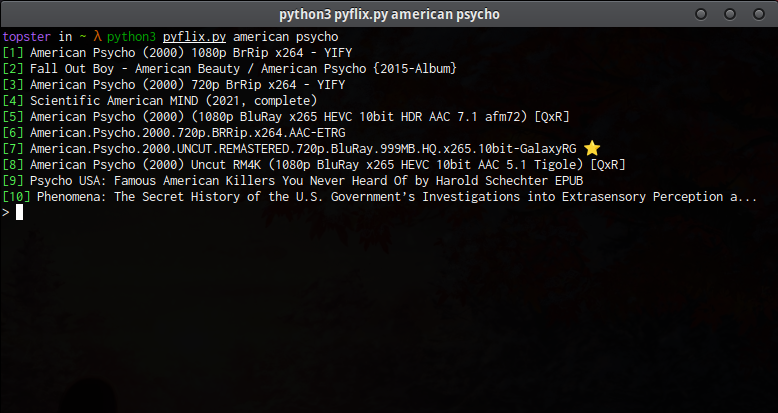

# Pyflix


## About
Pyflix is a python script that scrapes 1337x for magnet links and use [peerflix](https://github.com/mafintosh/peerflix) to stream them.<br>
This project was highly inspired by [notflix](https://github.com/Bugswriter/notflix).
## Requirements
* MPV (You can use another player as well see [peerflix usage](https://github.com/mafintosh/peerflix#usage))
* Python3
* BeatifulSoup (bs4) `pip install bs4`
* requests `pip install requests`
* [peerflix](https://github.com/mafintosh/peerflix) `sudo npm install peerflix -g`
## Download
``` sh
curl -O https://raw.githubusercontent.com/SrTopster/pyflix/main/pyflix.py
```
## Usage
``` sh
python3 pyflix.py movie name here
```
